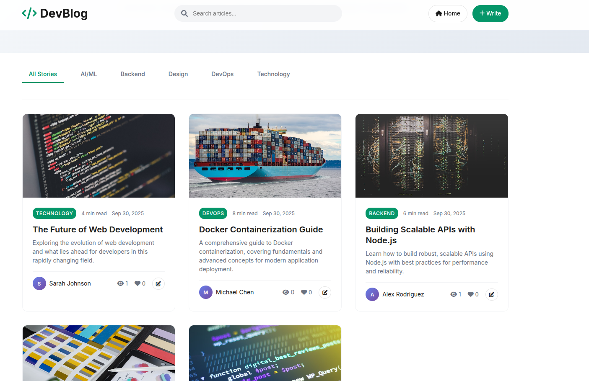

# DevBlog - Modern Blog Platform

[](https://www.docker.com/)
[](https://www.php.net/)
[](https://mariadb.org/)
[](LICENSE)

A modern, Medium-inspired blog platform built with PHP, MySQL, and Docker. Features a clean, responsive design with advanced functionality for content creators and readers.



## ✨ Features

### 🎨 **Modern Design**
- **Medium-inspired UI** with clean, professional styling
- **Responsive design** that works on all devices
- **Smooth animations** and hover effects
- **Inter font** for optimal readability

### 📝 **Content Management**
- **Full CRUD operations** for articles
- **Rich text editor** with formatting support
- **Article categories** and tagging system
- **Featured images** with automatic optimization
- **Reading time estimation** (based on 200 WPM)
- **Article excerpts** for better previews

### 🔍 **User Experience**
- **Real-time search** across titles, content, and authors
- **Category filtering** with active state indicators
- **Article statistics** (views, likes, reading time)
- **Social sharing** (Twitter, LinkedIn, copy link)
- **Like functionality** with AJAX updates
- **Author profiles** with avatar system

### 🚀 **Technical Features**
- **Dockerized** for easy deployment
- **LAMP stack** (Linux, Apache, MySQL, PHP)
- **Secure database** interactions with PDO
- **SEO-friendly** URLs and structure
- **Mobile-first** responsive design

## 🚀 Quick Start

### Prerequisites
- [Docker](https://www.docker.com/get-started) 20.10+
- [Docker Compose](https://docs.docker.com/compose/install/) (optional)

### Installation

1. **Clone the repository**
   ```bash
   git clone https://github.com/bakarys01/devblog.git
   cd devblog
   ```

2. **Build the Docker image**
   ```bash
   docker build -t devblog .
   ```

3. **Run the container**
   ```bash
   docker run -p 8080:80 devblog
   ```

4. **Access the application**
   Open your browser and navigate to: `http://localhost:8080`

### Alternative: Using Docker Compose (Recommended)

1. **Create docker-compose.yml** (optional for production)
   ```yaml
   version: '3.8'
   services:
     devblog:
       build: .
       ports:
         - "8080:80"
       volumes:
         - ./app:/var/www/html
         - ./db:/docker-entrypoint-initdb.d
   ```

2. **Run with Docker Compose**
   ```bash
   docker-compose up -d
   ```

## 📁 Project Structure

```
devblog/
├── app/                    # PHP application files
│   ├── index.php          # Main application entry point
│   └── db-config.php      # Database configuration
├── db/                     # Database files
│   └── articles.sql       # Database schema and sample data
├── Dockerfile             # Docker container configuration
├── README.md              # Project documentation
├── .gitignore             # Git ignore rules
└── LICENSE                # Project license
```

## 🔧 Configuration

### Environment Variables
You can customize the application using environment variables:

```bash
# Database configuration (defaults shown)
DB_HOST=localhost
DB_NAME=blog_db
DB_USER=root
DB_PASS=

# Application settings
APP_NAME="DevBlog"
APP_URL="http://localhost:8080"
```

### Custom Configuration
Edit `app/db-config.php` to modify database settings or add custom configuration options.

## 📖 Usage

### Creating Articles
1. Click the **"Write"** button in the header
2. Fill in the article details:
   - **Title**: Compelling headline
   - **Author**: Your name
   - **Category**: Select from available categories
   - **Tags**: Comma-separated keywords
   - **Featured Image**: URL to an image
   - **Content**: Your article content
3. Click **"Publish Story"**

### Managing Content
- **Edit**: Click the edit icon on any article card
- **Delete**: Use the delete button in the edit form
- **View Stats**: See views and likes on article cards
- **Search**: Use the search bar to find articles
- **Filter**: Click category tabs to filter content

### Social Features
- **Like Articles**: Click the heart icon
- **Share**: Use social sharing buttons on article pages
- **Copy Links**: Share direct links to articles

## 🏗️ Development

### Branching Strategy
- **`main`**: Production-ready code
- **`dev`**: Development and testing
- **`demo`**: Demo environment with sample data

### Local Development
1. **Switch to development branch**
   ```bash
   git checkout dev
   ```

2. **Make changes** to the codebase

3. **Test locally**
   ```bash
   docker build -t devblog-dev .
   docker run -p 8080:80 devblog-dev
   ```

4. **Commit and push**
   ```bash
   git add .
   git commit -m "feat: add new feature"
   git push origin dev
   ```

### Adding Features
1. Create a feature branch from `dev`
2. Implement your changes
3. Test thoroughly
4. Submit a pull request to `dev`

## 🔒 Security

- **SQL Injection Protection**: All queries use PDO prepared statements
- **XSS Prevention**: All user input is properly escaped
- **Input Validation**: Server-side validation for all forms
- **Database Security**: Secure database configuration

## 🚀 Deployment

### Production Deployment
1. **Build for production**
   ```bash
   docker build -t devblog:latest .
   ```

2. **Deploy to your server**
   ```bash
   docker run -d -p 80:80 --name devblog devblog:latest
   ```

### Cloud Deployment
The application is ready for deployment on:
- **AWS ECS/Fargate**
- **Google Cloud Run**
- **Azure Container Instances**
- **DigitalOcean App Platform**

## 🤝 Contributing

We welcome contributions! Please follow these steps:

1. **Fork** the repository
2. **Create** a feature branch (`git checkout -b feature/amazing-feature`)
3. **Commit** your changes (`git commit -m 'feat: add amazing feature'`)
4. **Push** to the branch (`git push origin feature/amazing-feature`)
5. **Open** a Pull Request

### Contribution Guidelines
- Follow PSR-12 coding standards
- Write descriptive commit messages
- Add tests for new features
- Update documentation as needed

## 📝 License

This project is licensed under the MIT License - see the [LICENSE](LICENSE) file for details.

## 👥 Authors

- **Bakary SIDIBE** - *Initial work* - [@bakarys01](https://github.com/bakarys01)
- **Email**: [bsidibe04@gmail.com](mailto:bsidibe04@gmail.com)

## 🙏 Acknowledgments

- Inspired by [Medium](https://medium.com) design principles
- Built with modern web technologies
- Community feedback and contributions

## 📞 Support

If you have any questions or issues:

1. **Check** existing [Issues](https://github.com/bakarys01/devblog/issues)
2. **Create** a new issue with detailed information
3. **Contact** the author: [bsidibe04@gmail.com](mailto:bsidibe04@gmail.com)

## 🔄 Changelog

### v1.0.0 (Latest)
- ✨ Initial release with full feature set
- 🎨 Medium-inspired design
- 📱 Responsive layout
- 🔍 Search and filtering
- 💖 Social features (likes, sharing)
- 🏷️ Categories and tags
- ⏱️ Reading time estimation

---

**Made with ❤️ for the developer community**